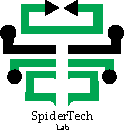

<h1 align="center">Hi 👋, I'm Mahabub Jamil</h1>

    
I'm a passionate programmer specializing in software development.

<h4>I am currently pursuing a Bachelor of Science in Computer Science and Engineering.</h4>

- 🌱 I’m currently learning **Flutter,MERN**

- 💬 Ask me about **Android development**

- 📫 How to reach me **rmahabub03@gmail.com**

**Skills:**
| Programming Languages        | Other Tools/Technologies       |
| ---------------------------- | ------------------------------ |
| Java                         | Figma                          |
| Dart                         | Adobe Photoshop/Illustrator    |
| C/C++                        | MySql                          |
| Python                       | Flutter                        |
| CSS                          | Java Swing                     |
| HTML/XML                     | JavaFX                         |

**Education:**
- SSC (Hasanali Government High School, Chandpur)
- HSC (Daffodil International College, Chandpur)
- Bachelor of Science in Computer Science & Engineering (Bangladesh University of Business & Technology, Dhaka)

**Voice communication:**
- English
- Bangla
- Hindi

> First, solve the problem. Then, write the code. – John Johnson

**Sports/Game/Activity/Hobby:**
- Football
- Marathon
- Physical workout
- Cricket
- Swimming
- Hiking

> Code is like humor. When you have to explain it, it’s bad. – Cory House

> Coding like poetry should be short and concise. ― Santosh Kalwar

<h3 align="left">Connect with me:</h3>

### Follow my facebook page. (Click on the logo)

